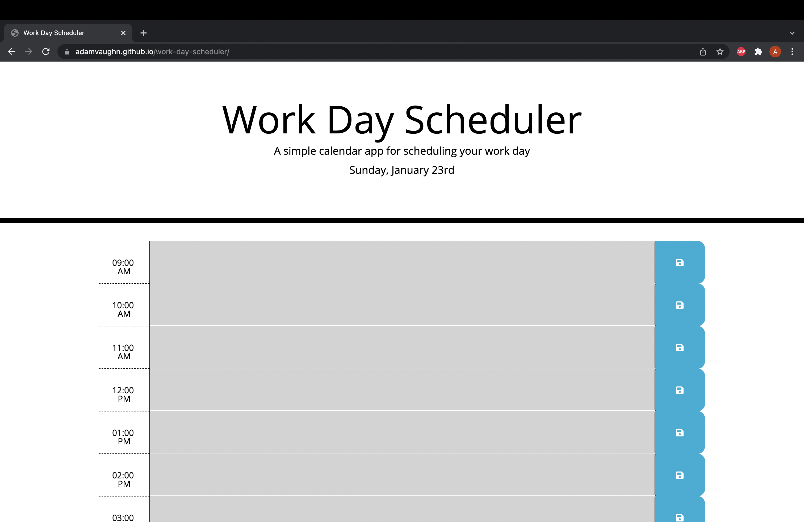

# Work Day Scheduler

### Purpose of app
- This app allows the user to plan out their workday from 9am to 5pm
- User may input data into time slots and save to local storage
- Time blocks are color coded based on time of day, past, present, and future.
- Todays date is displayed at the top of the page

### Example of app
</img>

### Project Links
- GitHub Repo: https://github.com/adamvaughn/work-day-scheduler
- Live Deploymet: https://adamvaughn.github.io/work-day-scheduler

### Contact Me
#### Adam Vaughn
 - adamdvaughn@gmail.com
 - https://github.com/adamvaughn
